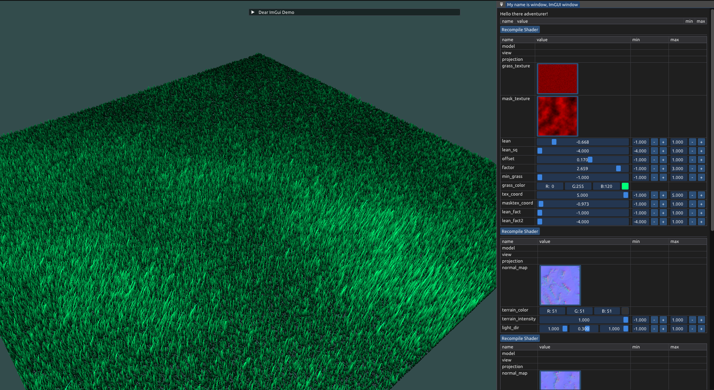
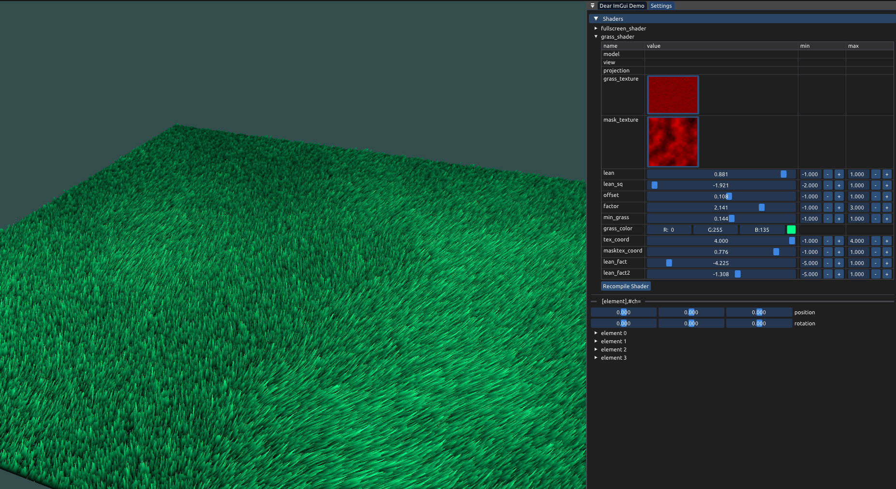

Directory structure
- bin
  - compiled binary and runtime resources
- build
  - intermediate compilation binaries
- content
  - version controlled runtime resources such as images, fonts, 
    heightmap data, etc
- docs
  - development logs, in-depth documentation, and images for ReadMe
- include
  - git submodules for external resources that are headers only, and headeds for source/header libs
- src
  - glacier source code

Grass demo:

---------------------actual readme above. bs thoughts below.-----------------------

TODO:
font
3D renderable text

library & executable separation
include & library inclusion as subrepositories? 
- somehow link them to their origin but include them in the repo
line drawing utility
geometry and compute shader boilerplate

-----

shader
- singleton for caching the shader programs
- copy program and master copy of uniform table from shader program
- if recompile create new instead of use cached
x cache values of shader values that persist
x include textures and autoset textures
  x display texture via imgui
x implement set_uniform
  - esp for 4x4 matrix
- cache shader location indices

texture
- alternate forms of image load, allow null image load
- resize
  
framebuffer
x copy basic implementation

terrain
x precompute normal map via framebuffer
- generate depth map
- depth shader
  
volumetric rendering

onscreen text
- freetype loader
- queue 2d and 3d text
- opacity

error handling and explanations
move to higher version of glfw and glad for better data and error handling

use git submodules for reproducability
- glm
- imgui
- implot
- stb_image

error handling/logging

devlogs under docs will become website later

update vscode settings and launch / debug stuff

debug draw - singleton
global imgui editor class
atmosphere
better terrain, remove terrain seams with positional indexing
blending
renderer
camera
- arc ball with set look_at
- pan
- callbacks that use dynamic pointer cast to allow callback into class

separate main.cpp and a main startup class
tree editor that generates imgui window for each element and its own shader as well
glfw window destroy

ideas:
- node editor
  - image loading in node editor
  - general system for viewing, editing, and printing openGL flags
  - for example, live editing blend modes or setup parameters for a particular framebuffer
  - then I can have a node graph of all the framebuffers
  - 
- model loading
- FFMPEG to disk
- bezier curve editor for animation

------

in order of importance
X build system via Make
- debug draw for 2D and 3D
- shader.cpp
- texture.cpp
- main fixed and cleaned
- framebuffer.cpp
- renderer.cpp
- generic settings editor that shader uses
- can generate table from array of itself

imgui generic matrix editors and vector viewers

imguizmo

imgui docking
https://github.com/ocornut/imgui/issues/5921

style
imgui colors need to be a little brighter, dark mode is too harsh currently
rounding on elements

ImVec4* colors = ImGui::GetStyle().Colors;
colors[ImGuiCol_Text]                   = ImVec4(1.00f, 1.00f, 1.00f, 1.00f);
colors[ImGuiCol_TextDisabled]           = ImVec4(0.50f, 0.50f, 0.50f, 1.00f);
colors[ImGuiCol_WindowBg]               = ImVec4(0.12f, 0.12f, 0.12f, 0.94f);
colors[ImGuiCol_ChildBg]                = ImVec4(0.00f, 0.00f, 0.00f, 0.00f);
colors[ImGuiCol_PopupBg]                = ImVec4(0.08f, 0.08f, 0.08f, 0.94f);
colors[ImGuiCol_Border]                 = ImVec4(0.43f, 0.43f, 0.50f, 0.50f);
colors[ImGuiCol_BorderShadow]           = ImVec4(0.00f, 0.00f, 0.00f, 0.00f);
colors[ImGuiCol_FrameBg]                = ImVec4(0.16f, 0.29f, 0.48f, 0.54f);
colors[ImGuiCol_FrameBgHovered]         = ImVec4(0.26f, 0.59f, 0.98f, 0.40f);
colors[ImGuiCol_FrameBgActive]          = ImVec4(0.26f, 0.59f, 0.98f, 0.67f);
colors[ImGuiCol_TitleBg]                = ImVec4(0.28f, 0.28f, 0.28f, 1.00f);
colors[ImGuiCol_TitleBgActive]          = ImVec4(0.16f, 0.29f, 0.48f, 1.00f);
colors[ImGuiCol_TitleBgCollapsed]       = ImVec4(0.00f, 0.00f, 0.00f, 0.51f);
colors[ImGuiCol_MenuBarBg]              = ImVec4(0.14f, 0.14f, 0.14f, 1.00f);
colors[ImGuiCol_ScrollbarBg]            = ImVec4(0.02f, 0.02f, 0.02f, 0.53f);
colors[ImGuiCol_ScrollbarGrab]          = ImVec4(0.31f, 0.31f, 0.31f, 1.00f);
colors[ImGuiCol_ScrollbarGrabHovered]   = ImVec4(0.41f, 0.41f, 0.41f, 1.00f);
colors[ImGuiCol_ScrollbarGrabActive]    = ImVec4(0.51f, 0.51f, 0.51f, 1.00f);
colors[ImGuiCol_CheckMark]              = ImVec4(0.26f, 0.59f, 0.98f, 1.00f);
colors[ImGuiCol_SliderGrab]             = ImVec4(0.24f, 0.52f, 0.88f, 1.00f);
colors[ImGuiCol_SliderGrabActive]       = ImVec4(0.26f, 0.59f, 0.98f, 1.00f);
colors[ImGuiCol_Button]                 = ImVec4(0.26f, 0.59f, 0.98f, 0.40f);
colors[ImGuiCol_ButtonHovered]          = ImVec4(0.26f, 0.59f, 0.98f, 1.00f);
colors[ImGuiCol_ButtonActive]           = ImVec4(0.06f, 0.53f, 0.98f, 1.00f);
colors[ImGuiCol_Header]                 = ImVec4(0.26f, 0.59f, 0.98f, 0.31f);
colors[ImGuiCol_HeaderHovered]          = ImVec4(0.26f, 0.59f, 0.98f, 0.80f);
colors[ImGuiCol_HeaderActive]           = ImVec4(0.26f, 0.59f, 0.98f, 1.00f);
colors[ImGuiCol_Separator]              = ImVec4(0.43f, 0.43f, 0.50f, 0.50f);
colors[ImGuiCol_SeparatorHovered]       = ImVec4(0.10f, 0.40f, 0.75f, 0.78f);
colors[ImGuiCol_SeparatorActive]        = ImVec4(0.10f, 0.40f, 0.75f, 1.00f);
colors[ImGuiCol_ResizeGrip]             = ImVec4(0.26f, 0.59f, 0.98f, 0.20f);
colors[ImGuiCol_ResizeGripHovered]      = ImVec4(0.26f, 0.59f, 0.98f, 0.67f);
colors[ImGuiCol_ResizeGripActive]       = ImVec4(0.26f, 0.59f, 0.98f, 0.95f);
colors[ImGuiCol_TabHovered]             = ImVec4(0.26f, 0.59f, 0.98f, 0.80f);
colors[ImGuiCol_Tab]                    = ImVec4(0.18f, 0.35f, 0.58f, 0.86f);
colors[ImGuiCol_TabSelected]            = ImVec4(0.20f, 0.41f, 0.68f, 1.00f);
colors[ImGuiCol_TabSelectedOverline]    = ImVec4(0.26f, 0.59f, 0.98f, 1.00f);
colors[ImGuiCol_TabDimmed]              = ImVec4(0.07f, 0.10f, 0.15f, 0.97f);
colors[ImGuiCol_TabDimmedSelected]      = ImVec4(0.14f, 0.26f, 0.42f, 1.00f);
colors[ImGuiCol_TabDimmedSelectedOverline]  = ImVec4(0.50f, 0.50f, 0.50f, 0.00f);
colors[ImGuiCol_DockingPreview]         = ImVec4(0.26f, 0.59f, 0.98f, 0.70f);
colors[ImGuiCol_DockingEmptyBg]         = ImVec4(0.20f, 0.20f, 0.20f, 1.00f);
colors[ImGuiCol_PlotLines]              = ImVec4(0.61f, 0.61f, 0.61f, 1.00f);
colors[ImGuiCol_PlotLinesHovered]       = ImVec4(1.00f, 0.43f, 0.35f, 1.00f);
colors[ImGuiCol_PlotHistogram]          = ImVec4(0.90f, 0.70f, 0.00f, 1.00f);
colors[ImGuiCol_PlotHistogramHovered]   = ImVec4(1.00f, 0.60f, 0.00f, 1.00f);
colors[ImGuiCol_TableHeaderBg]          = ImVec4(0.19f, 0.19f, 0.20f, 1.00f);
colors[ImGuiCol_TableBorderStrong]      = ImVec4(0.31f, 0.31f, 0.35f, 1.00f);
colors[ImGuiCol_TableBorderLight]       = ImVec4(0.23f, 0.23f, 0.25f, 1.00f);
colors[ImGuiCol_TableRowBg]             = ImVec4(0.00f, 0.00f, 0.00f, 0.00f);
colors[ImGuiCol_TableRowBgAlt]          = ImVec4(1.00f, 1.00f, 1.00f, 0.06f);
colors[ImGuiCol_TextLink]               = ImVec4(0.26f, 0.59f, 0.98f, 1.00f);
colors[ImGuiCol_TextSelectedBg]         = ImVec4(0.26f, 0.59f, 0.98f, 0.35f);
colors[ImGuiCol_DragDropTarget]         = ImVec4(1.00f, 1.00f, 0.00f, 0.90f);
colors[ImGuiCol_NavCursor]              = ImVec4(0.26f, 0.59f, 0.98f, 1.00f);
colors[ImGuiCol_NavWindowingHighlight]  = ImVec4(1.00f, 1.00f, 1.00f, 0.70f);
colors[ImGuiCol_NavWindowingDimBg]      = ImVec4(0.80f, 0.80f, 0.80f, 0.20f);
colors[ImGuiCol_ModalWindowDimBg]       = ImVec4(0.80f, 0.80f, 0.80f, 0.35f);

https://skytiger.wordpress.com/2010/11/28/xna-large-terrain/
https://casual-effects.blogspot.com/2014/04/fast-terrain-rendering-with-continuous.html
